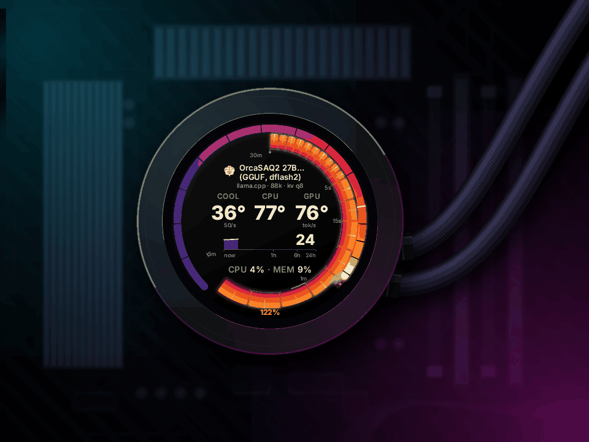
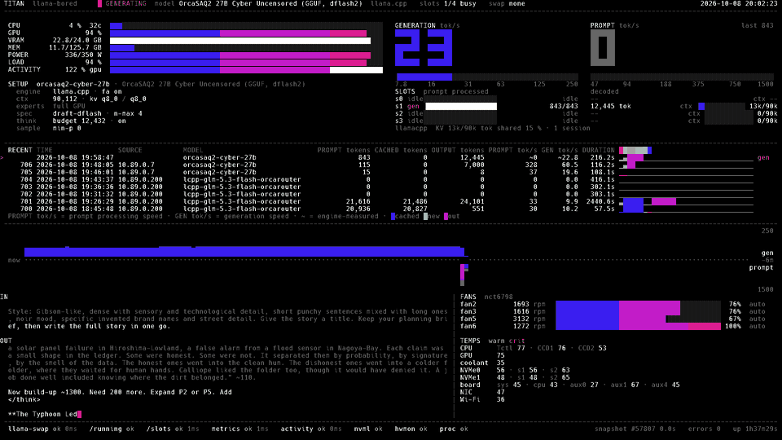
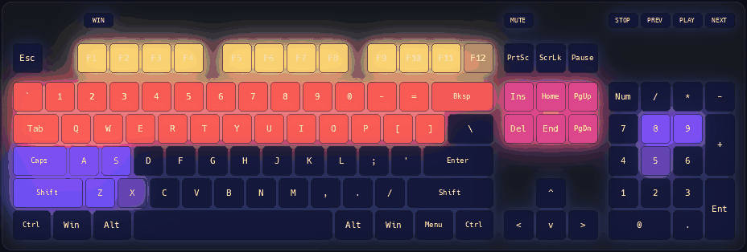

# llama-bored

**It's for watching when you're bored waiting on your agent.**

Live telemetry from a local-AI box on Linux: llama.cpp through
[llama-swap](https://github.com/mostlygeek/llama-swap), GPU, CPU, power and
temperatures. It shows up on a full-screen tty11 dashboard, on the 320x320
round LCD of an NZXT Kraken Z cooler, on your case RGB, and on a Prometheus
endpoint. Your agent runs a 20-minute job on a local model; you get something
to look at while it does.

It never touches the pump or fans. Everything it draws on hardware is colour
and pixels, through small closed command sets.

It needs Linux with systemd. Everything else is optional: an NZXT Kraken Z
(`1e71:3008`) for the LCD, NVIDIA, llama-swap, ASUS Aura and the Corsair
keyboard. Without a Kraken Z the installer sets up everything except the
LCD writer.

<p align="center">
  
</p>

<p align="center">
  
</p>

<sub>Both recorded from the same 12 seconds on a real box: one model unloads,
Qwen3-Coder loads onto the GPU, and generation ramps to about 160 tok/s. The
LCD frames are rendered by kraken-lcd from recorded snapshots and set into a
drawn pump-head scene; the tty11 frames come from the console's own screen
buffer.</sub>

## Components

| Binary | Unit | What it does |
|---|---|---|
| `llama-watch` | `llama-watch.service` | The **single reader** of host and llama state. Draws the tty11 dashboard (Ctrl+Alt+F11 from a graphical session, Alt+F11 from another console) and publishes a validated snapshot to `/run/llama-watch/snapshot.json` at 10 Hz |
| `llama-view` | none | Read-only mirror of tty11 for tmux or SSH (group `llama-view`) |
| `kraken-lcd` | `kraken-lcd.service` | Draws the snapshot on the NZXT Kraken Z LCD. LCD only, no network |
| `llama-light` | `llama-light.service` | Sets ASUS Aura and Corsair keyboard RGB colours from the snapshot. Colour only, no network |
| `llama-metrics` | `llama-metrics.service` | Prometheus exporter on port 19477 (`llamabored_*`). The only process that listens |

`llama-core` is the shared library: the snapshot schema and its validator, the
name sanitiser, logging.

## Features

**llama-watch and tty11** (10 fps, bundled Hack 12x24 console font)

- Spectrum meters for CPU, GPU, VRAM, MEM, POWER and LOAD, and an **ACTIVITY** row that
  names its source (`gpu`, `cpu` or `util`).
- Prompt and generation tok/s, and a token chart in eighth-block bars
  (generation up, prompt down, newest on the left), log-scaled to
  `gen_ceiling_tps` and `prompt_ceiling_tps`.
- **SLOTS:** per-slot context fill and a context-history sparkline (6 h by
  default) with a marker where a context dropped, labelled by best-guess
  reason from token counts: `c` compacted (same conversation, mostly
  cached), `n` new conversation, `e` evicted (a conversation came back with
  nothing cached), red `v` unknown.
- **RECENT:** the last requests across the full width, with timestamps.
- **IN / OUT:** the live prompt and output tails of the busy slot. IN strips
  chat-template tokens by default. For SGLang, vLLM and other servers
  without `/slots`, IN/OUT show the last finished exchange from llama-swap's
  request captures (when its `captureBuffer` is on; read up to 2 MiB per
  capture). Turn all text off, captures included, with `show_text = false`.
- **FANS** (optional): read-only rpm and pwm of motherboard fans from a
  Super-I/O hwmon chosen by name.
- The model's full name and a tuning line (ctx, KV cache type, quant, CPU MoE
  layers) read from llama-swap's launch command.

**Activity** is the bottleneck device's power headroom. For the GPU (NVML) and
the CPU (zenergy socket energy), `(watts − idle) / (nominal_frac × limit −
idle)`; the larger wins. 100 is sustained heavy load, spikes reach 125. Idle
floors are learned from 10 s means and never rise. Without power sensors it
falls back to utilisation.

**kraken-lcd** ("V3b Plasma Blackbody" face)

- A 270° activity gauge, 0–125, with a 100–125 redline where spikes glow
  blackbody-hot and a pegged gauge throws smoke and embers.
- An inner dial of 24 bars with 30 minutes of activity history and a time
  scale; a tokens·24h chart; model name and tuning line; coolant, CPU and GPU
  temperatures; CPU and memory.
- Distinct "AI down", "no model" and "no data" states. After 30 s without data
  the LCD returns to the stock coolant screen.
- *Change* mode (default: upload only when a drawn value changes, at most once
  per `min_interval_s`) or opt-in *stream* mode (10 fps, animated gauge).

**llama-light** (ASUS Aura USB RGB, Corsair STRAFE RGB MK.2 keyboard)

- Maps any snapshot metric (activity, gpu, cpu, cpu_topk (the busiest
  cores), load, mem, tokens_rate, coolant, gpu_temp, cpu_temp) to colour,
  with `[[light]]` layers: solid, ring, bar or pulse styles, palettes or your own colour stops, smoothing,
  brightness caps and an idle colour.
- Fans on a splitter (mirrored) or a daisy chain (per-fan values).
- Per-key keyboard gauges: bars two key rows tall, a tokens/s dial on the
  number pad, with an optional tweened frame pipeline so values glide
  instead of flicker. The example file has a full layout. On stop the
  keyboard gets its own lighting back.

  

  <sub>The keyboard layout during the same 12 seconds, computed by llama-light
  from the recorded snapshots and drawn with simulated keycap bleed.</sub>
- Live reload: edits to `light.toml` apply within 2 s; a bad file is logged
  and ignored.

**llama-metrics** (Prometheus)

- `GET /metrics` on `:19477` for a CIDR allowlist. Numbers and model names
  only; never prompt or output text. Everything the dashboards show is
  exported (a test fails if a snapshot field is not):

| Series | Labels | Meaning |
|---|---|---|
| `llamabored_activity_pct`, `_load_pct`, `_cpu_pct`, `_cpu_topk_pct`, `_gpu_pct`, `_mem_pct` | | Host load, % |
| `llamabored_coolant_celsius`, `_cpu_celsius`, `_gpu_celsius` | | Temperatures |
| `llamabored_gpu_power_watts`, `_gpu_power_limit_watts`, `_cpu_power_watts` | | Power draw and GPU limit |
| `llamabored_gpu_memory_used_bytes`, `_total_bytes`; `llamabored_memory_used_bytes`, `_total_bytes` | | VRAM and system memory |
| `llamabored_tokens_decoded_total`, `llamabored_tokens_prompt_total` | | Counters since the watcher started; use `rate()` for tok/s |
| `llamabored_ai_state` | `state` | down / idle / loaded |
| `llamabored_model_loaded`, `_model_ctx_size_tokens`, `_model_state` | `name`, `full_name`, ... | Loaded models, context size, lifecycle (ready / starting / stopping) |
| `llamabored_slots_busy`, `llamabored_slots_total` | `name`, `full_name` | llama.cpp slots |
| `llamabored_slot_ctx_used_tokens` | `name`, `full_name`, `slot` | Context a llama.cpp slot holds |
| `llamabored_slot_ctx_resets_total` | `name`, `full_name`, `slot`, `reason` | Context drops by best-guess reason (compacted, new, evicted, unknown) |
| `llamabored_model_prompt_tokens_total`, `_model_prompt_cached_tokens_total` | `name`, `full_name` | Prompt tokens and the cached part; hit ratio = `rate(cached) / rate(total)` |
| `llamabored_model_requests_running`, `_requests_queued`, `_kv_cache_usage_ratio`, `_cache_hit_ratio` | `name`, `full_name` | SGLang / vLLM request and cache gauges |
| `llamabored_fan_rpm`, `llamabored_fan_pwm_ratio` | `channel`, `label` | FANS panel, when `[fans]` is on (read only) |
| `llamabored_source_up`, `llamabored_source_latency_seconds` | `source` | Health of each watcher source (llama-swap, running, slots, metrics, activity, gpu, hwmon, proc) |
| `llamabored_snapshot_up`, `_snapshot_stale`, `_snapshot_age_seconds`, `_snapshot_seq` | | Snapshot freshness |
| `llamabored_exporter_build_info`, `_exporter_rejected_connections_total` | | Exporter version and refusals |

**Backends behind llama-swap.** llama-bored tells each model's server apart
by its launch command (or `[llama.backends]` in `watch.toml`):

| Backend | What you get |
|---|---|
| llama.cpp `llama-server` and forks (ik_llama.cpp, PrismML) | Everything: tok/s, SLOTS with context fill and reset reasons, live IN/OUT text, the tuning line |
| SGLang | tok/s, running and queued requests, KV fill and cache hit rate from `sglang:*` metrics (start it with `--enable-metrics`); tuning line from its flags; IN/OUT from llama-swap captures |
| vLLM | The same from `vllm:*` metrics; tuning line from its flags; IN/OUT from llama-swap captures |
| Any other OpenAI-compatible server (TabbyAPI, ...) | Token counts from llama-swap's request log; GPU, CPU and activity as always |

A llama.cpp server started through a wrapper script, without `llama-server`
in its command, needs `"model-id" = "llamacpp"` under `[llama.backends]`.

**Works without AI:** llama-swap, NVIDIA, the power sensors and the Aura
controller are optional; missing sources show "—".

## Supported hardware

| Device | USB id | Status |
|---|---|---|
| NZXT Kraken **Z53** | `1e71:3008` | **Tested** (kraken-lcd) |
| NZXT Kraken Z63 / Z73 | `1e71:3008` (same id) | Same LCD protocol, accepted, **untested** |
| Other NZXT (Kraken 2023/Elite, X-series) | other ids | Not supported; kraken-lcd refuses them |
| ASUS Aura USB mainboard controller | `0b05:18f3` | **Tested** (llama-light, addressable header 1) |
| Corsair STRAFE RGB MK.2 | `1b1c:1b48` | **Tested** (llama-light, per key, lighting interface only) |
| Other Corsair keyboards | other ids | Not supported |

The Z63 and Z73 report the same USB id and `z53` hwmon name as the Z53, so no
software check can tell them apart. If you try one, read
[docs/SAFETY.md](docs/SAFETY.md) first and stay close for the first run.

## Requirements

- Linux with **systemd**.
- For the LCD (optional): one NZXT Kraken Z and the **`nzxt-kraken3`** hwmon
  driver (mainline since 6.9) bound to it. With none attached the installer
  skips kraken-lcd's unit, udev rules and state directory (the binary is
  still installed) and says how to add it later: attach the cooler and run
  the installer again. With more than one it refuses.
- **Rust** via rustup (`rust-toolchain.toml` pins the version), plus
  `cargo-deny` and `cargo-audit` for `scripts/check.sh`.
- For the build and install scripts: `git`, a C compiler as the linker
  (`cc`), `nm` (binutils), `ldd` (glibc), `sha256sum` (coreutils),
  `setfacl`/`getfacl` (acl), and udev and `systemd-sysusers`. `python3` is
  optional (the font rebuild check is skipped without it).
- Optional: an **NVIDIA** GPU and driver (NVML); **llama-swap** on loopback
  (`llama-server --metrics` for token rates, `LLAMA_SERVER_SLOTS_DEBUG=1` for
  live text); **zenergy** (AMD socket power); **k10temp** or **coretemp**; a
  **Super-I/O hwmon** (`nct67xx`, `it87`, ...) for FANS.

## Safety model

The Kraken's USB device drives the LCD **and** the CPU pump and fans; the Aura
controller also runs fan-header lighting. The design treats cooling as the
main risk:

- **Closed command sets.** kraken-lcd can build nine LCD commands; pump, fan,
  init, brightness and firmware commands do not exist in the code.
  llama-light can build two Aura opcodes (set direct mode, stream colours) and
  four keyboard report shapes, with no save-to-flash, profile or firmware
  writes. Tests check all three tables.
- **Cooling guard and HALTED latch.** Every LCD operation is bracketed by
  read-only checks of the cooler's hwmon (pump mode, pump rpm, USB device,
  bootloader). Any change stops all device I/O and writes a latch file that
  stays until an explicit root command clears it.
- **Nothing writes sysfs.** The FANS panel only reads.
- **Split privileges.** One reader with no device access; writers with no
  network and only their own device nodes. kraken-lcd's hidraw grant is
  pinned by udev and `DeviceAllow=` to the cooler's node; its usbfs grant is
  class-wide in the unit, and udev gives only the cooler's usbfs node to its
  group. llama-light is pinned the same way to two hidraw nodes, the Aura
  controller and the keyboard's lighting interface. One exporter that opens
  no device. Only llama-metrics listens.
- **Stock restore on stop.** Stopping or crashing kraken-lcd gives the screen
  back to the stock readout; llama-light leaves a neutral colour in RAM and
  hands the keyboard back to its own lighting.

Details: [docs/SAFETY.md](docs/SAFETY.md), [docs/ARCHITECTURE.md](docs/ARCHITECTURE.md).

## Install (the lazy way)

Point your AI agent (with root, and you nearby) at
[`skills/install/SKILL.md`](skills/install/SKILL.md): *Install llama-bored on
this machine following skills/install/SKILL.md*. It checks the machine, builds
and verifies as your normal user, writes the configs from what it detects
(asking you about text panels, fans, RGB, the exporter and stream mode),
installs, and does a guarded first LCD write. It has hard rules against
touching cooling.

## Manual install

As your normal user; `sudo` only where shown.

```sh
git clone https://github.com/alexderz/llama-bored && cd llama-bored
git switch main
scripts/check.sh                  # fmt, clippy, tests, deny, audit, safety fences, release build
scripts/cooling-snapshot.sh | tee ~/cooling-before.txt
sudo scripts/install.sh           # add --enable-light to enable RGB for boot; save the rollback text
```

`install.sh` installs only a build that `check.sh` produced from a **clean
tree whose HEAD is on `main`**, with matching binary hashes. It creates the
users and udev rules, creates `/var/lib/kraken-lcd`, enables `llama-watch`,
and **never starts kraken-lcd**. llama-light is enabled only with
`--enable-light`; llama-metrics is never enabled. Then, as root:

```sh
systemctl start llama-watch                           # tty11: Ctrl+Alt+F11
d=$(mktemp -d) && chmod 0755 "$d" && install -m 0644 fixtures/views/test-card.json "$d/"
runuser -u kraken-lcd -- /usr/local/libexec/llama-bored/kraken-lcd show-image --view "$d/test-card.json"
```

The LCD shows a "TEST IMAGE" card. Run `scripts/cooling-snapshot.sh` and
compare: `pwm1_enable`/`pwm2_enable` unchanged, pump rpm about the same. Then:

```sh
sudo systemctl enable --now kraken-lcd
sudo systemctl start llama-light                         # optional RGB; enable to keep it
sudo systemctl --global enable kraken-lcd-halt.path      # optional desktop alert on HALTED
sudo usermod -aG llama-view "$USER"                      # optional, for llama-view; log in again
```

Installed: binaries in `/usr/local/libexec/llama-bored/` and
`/usr/local/bin/llama-view`, the font in `/usr/local/share/llama-bored/`,
configs in `/etc/llama-bored/`, units in `/etc/systemd/system/` and
`/etc/systemd/user/`, udev rules `71-kraken-lcd`, `72-llama-view`,
`93-kraken-lcd-hidraw` and `94-llama-light-hidraw` in `/etc/udev/rules.d/`,
users from `/etc/sysusers.d/llama-bored.conf`. Stable device links:
`/dev/kraken-lcd/hid`, `/dev/llama-light/aura` and
`/dev/llama-light/keyboard`.

## Configuration

Four files in `/etc/llama-bored/`, one per service. The installer copies each
example from `packaging/` only if the file does not exist, and never
overwrites your edits. Every key has a default and a range (see the comments
in the examples), except `listen` and `allow` in `metrics.toml`, which are
required. Check a file without starting anything:

```sh
/usr/local/libexec/llama-bored/llama-light check --config /etc/llama-bored/light.toml
/usr/local/libexec/llama-bored/llama-metrics check --config /etc/llama-bored/metrics.toml
```

**`watch.toml`** (llama-watch):

| Key | Meaning |
|---|---|
| `[llama] enabled`, `url` | Poll llama-swap at a **loopback** URL (default `http://127.0.0.1:8080`). Point it at llama-swap itself, not a proxy in front of it |
| `[llama.backends]` | `"model-id" = "llamacpp"`, `"sglang"`, `"vllm"` or `"openai"`: overrides the backend detected from the launch command |
| `[models.aliases]` | `"long-model-id" = "Short Name"` |
| `[load] cpu_limit_w`, `nominal_frac` | CPU full-load socket watts; `nominal_frac` (0.8) of each limit reads 100 |
| `[load] idle`, `gpu_idle_w`, `cpu_idle_w` | `"auto"` learns idle floors; `"fixed"` uses the watts as given |
| `[tty] blank_min`, `sleep_min` | Burn-in guard for the tty11 monitor: blank after N min without a keypress, power down at M (0 = off) |
| `[tty] show_text`, `prompt_view` | Show the live prompt/output (`true`) and strip chat templates (`"clean"`) or not (`"raw"`) |
| `[tty] gen_ceiling_tps`, `prompt_ceiling_tps` | Tops of the tok/s scales (250, 1500) |
| `[tty] font`, `size` | `"12x24"` (default) or `"12x22"`; `size = "COLSxROWS"` (160x26 to 1024x512) sizes tty11 at start. See below |
| `[tty] chart_glyphs`, `ctx_history_h` | `"eighths"` (bundled font) or `"halves"`; SLOTS history hours (1–24) |
| `[fans] enabled`, `hwmon`, `channels`, `labels` | Off by default. `hwmon` is a **name** from `cat /sys/class/hwmon/*/name` |

**`config.toml`** (kraken-lcd):

| Key | Meaning |
|---|---|
| `[upload] mode`, `stream_fps` | `"change"` (default) or `"stream"` (1–12 fps, 10 by default) |
| `[upload] min_interval_s` | Change-mode gap between uploads (floor 10). Re-run `install.sh` after changing it, so `RestartSec` follows |
| `[snapshot] stale_after_s`, `watch_down_stock_after_s` | When "no data" starts (1 s) and when the stock screen returns (30 s) |
| `[display] variant`, `rotate_deg` | `a1` (with tokens·24h) or `a3` (dial-first); 0/90/180/270 |

**`light.toml`** (llama-light):

```toml
[aura]
enabled = true
leds_per_fan = 6          # 1..=20
fans = "mirrored"         # "mirrored" (splitter) or "chain" (daisy chain)
# chain_len = 4           # fans = "chain" only, 1..=8
brightness_max = 80       # cap on every LED, 0..=100 %
fps = 10

[keyboard]
enabled = false           # Corsair STRAFE RGB MK.2, per key
brightness_max = 100

[[light]]                 # later entries draw over earlier ones
target = "aura.fans"      # or "aura.chain[2]", 'keyboard.keys["F1".."F12"]', "led:110"
metric = "activity"       # gpu, cpu, cpu_topk, load, mem, tokens_rate, coolant, gpu_temp, cpu_temp
range = [0, 100]
style = "solid"           # solid | ring | bar | pulse | ladder | gate | peak
palette = "act"           # act | thermal | mono, or stops = [[0, "#4A55C8"], [100, "#FF3A22"]]
smooth_s = 1.5
idle_color = "#101830"
```

With no `[[light]]` entries every fan shows activity on the LCD's colour ramp.
**Mirrored vs chained:** on a splitter every fan receives the same data, so
all fans always show the same thing. Per-fan metrics (`aura.chain[N]`) need
the fans daisy-chained on one data line (fan N is LEDs `N × leds_per_fan` on).
The example file has complete examples for both, and a full keyboard layout
(`keyboard-c`) with `[engine]` tweening, a `[base]` colour and named palettes.

**`metrics.toml`** (llama-metrics):

| Key | Meaning |
|---|---|
| `listen` | Required. `"0.0.0.0:19477"`; `"[::]:19477"` for dual-stack |
| `allow` | Required. CIDR allowlist, checked before a byte is read. Ships as `["192.168.0.0/16", "127.0.0.1/32"]`: **narrow it to your LAN** |
| `max_conns`, `stale_after_s` | Concurrent connections (16); snapshot age that counts as stale (5 s) |

Keep `allow` equal to `IPAddressAllow=` in `llama-metrics.service`, and the
port equal to `SocketBindAllow=`; the unit is the kernel's copy of the rule.
Use a drop-in (`IPAddressAllow=` on its own line first resets the list).
Enable it and open the port yourself:

```sh
sudo systemctl enable --now llama-metrics
curl -s http://127.0.0.1:19477/metrics | head
sudo firewall-cmd --permanent --zone=internal --add-port=19477/tcp && sudo firewall-cmd --reload
```

Scrape it from Prometheus:

```yaml
scrape_configs:
  - job_name: llamabored
    scrape_interval: 5s
    static_configs:
      - targets: ["ai-box.lan:19477"]
```

After editing `watch.toml` or `config.toml`, restart that service
(`llama-watch` or `kraken-lcd`). `light.toml` reloads by itself.

**tty11 on small or mixed screens.** Every display on a GPU shows the same
console, sized at boot for the largest one, so a smaller screen shows only
tty11's top-left corner. Size tty11 for the smallest screen:

```toml
[tty]
font = "12x22"     # "12x24" (default) or "12x22": same glyphs, two more rows
size = "160x49"    # COLSxROWS, 160x26 to 1024x512; unset keeps the boot size
```

At 1920x1080 the 12x24 font gives 160x45 and the 12x22 font 160x49.
`llama-watch.service` applies both before the watcher starts, through a root
pre-step (`llama-watch tty-setup`) that runs `setfont` and `stty` from the
validated values; restart the unit after a change. Under 48 rows the
dashboard drops panels to fit (IN/OUT first, then FANS, then the chart
shrinks) and shows `tty too small` only below 160x26.

## Troubleshooting

| Symptom | What to check |
|---|---|
| "no NZXT Kraken Z LCD (1e71:3008) found" | `lsusb -d 1e71:`. Other NZXT models are not supported |
| kraken-lcd exits: no `z53` hwmon | The `nzxt-kraken3` driver is not bound: `cat /sys/class/hwmon/*/name` |
| `install.sh` refuses the tree | Commit or stash, `git switch main`, re-run `scripts/check.sh`, install without editing |
| `install.sh`: "a previous install failed" | Run the rollback in `ROLLBACK_PENDING`, then retry |
| LCD says **no data** | llama-watch is stopped or failing: `journalctl -u llama-watch` |
| LCD says **AI down** | llama-swap is not answering at `[llama] url` |
| LCD frozen, `journalctl -u kraken-lcd -p crit` shows `cooling guard halted` or `cooling guard latch is present` | The cooling guard tripped. Check the cooler, read `/var/lib/kraken-lcd/halted`, then `sudo /usr/local/libexec/llama-bored/kraken-lcd clear-halt` and restart kraken-lcd |
| `show-image`: interface 0 is bound | kraken-lcd is running. Stop it first |
| LCD or RGB stops after a replug or resume | The hidraw node got a new number; restart `kraken-lcd` or `llama-light` |
| Gauge never passes ~50, or pegs at idle | Tune `[load] cpu_limit_w` and the idle watts; the ACTIVITY row shows the source |
| tty11 IN/OUT empty | `LLAMA_SERVER_SLOTS_DEBUG=1` for llama-server, and `[tty] show_text` |
| tty11 chart shows odd glyphs | The font did not load; set `chart_glyphs = "halves"` |
| RGB does nothing | `lsusb -d 0b05:18f3`, `ls -l /dev/llama-light/aura`, `journalctl -u llama-light` (`aura absent (...)` names why), `/usr/local/libexec/llama-bored/llama-light check --config /etc/llama-bored/light.toml`. Only one RGB tool (OpenRGB, vendor tools) at a time |
| Keyboard stays on its own lighting | `lsusb -d 1b1c:1b48`, `ls -l /dev/llama-light/keyboard`, `[keyboard] enabled = true`. Only one RGB tool (ckb-next, OpenRGB) at a time. Plugged in after llama-light started: it restarts itself to pick it up |
| All fans show one colour with `aura.chain[N]` | The fans are on a splitter. Use `fans = "mirrored"` or daisy-chain them |
| Prometheus gets no answer | `allow`, `IPAddressAllow=`, and the firewall; `llamabored_exporter_rejected_connections_total` counts refusals |
| `llamabored_snapshot_stale` is 1 | llama-watch is down or behind |
| `llama-view`: permission denied | Join `llama-view`, then log in again |
| LCD stays on stock | Another tool (CoolerControl, liquidctl scripts) may drive the LCD. Run one |

## Uninstall and rollback

**One install run:** `install.sh` prints the exact commands that undo it. A
failed run also saves them to `/usr/local/libexec/llama-bored/ROLLBACK_PENDING`,
and the next install refuses until you run them. Stop the writers first.

**Full uninstall:**

```sh
sudo systemctl disable --now llama-metrics llama-light kraken-lcd llama-watch
sudo systemctl --global disable kraken-lcd-halt.path
sudo rm -rf /usr/local/libexec/llama-bored /usr/local/share/llama-bored /etc/llama-bored /var/lib/kraken-lcd
sudo rm -f /usr/local/bin/llama-view /etc/sysusers.d/llama-bored.conf \
  /etc/systemd/system/{kraken-lcd,llama-watch,llama-light,llama-metrics}.service \
  /etc/systemd/user/kraken-lcd-halt.path /etc/systemd/user/kraken-lcd-halt-notify.service \
  /etc/udev/rules.d/{71-kraken-lcd,72-llama-view,93-kraken-lcd-hidraw,94-llama-light-hidraw}.rules
sudo rm -rf /etc/systemd/system/llama-metrics.service.d   # the IPAddressAllow= drop-in, if you made one
sudo systemctl daemon-reload && sudo udevadm control --reload
sudo udevadm trigger --action=change --subsystem-match=hidraw
sudo udevadm trigger --action=change --attr-match=idVendor=1e71 --attr-match=idProduct=3008
for u in kraken-lcd llama-watch llama-light llama-metrics; do sudo userdel "$u"; done; sudo groupdel llama-view
```

Close the firewall port if you opened it. Nothing on the devices needs
undoing: the Kraken's frame memory and the Aura direct colours are RAM, and
the board's stored lighting effect returns at the next power cycle.

## Credits and license

Built with Claude Code and Grok: Claude (Opus, Fable) for design, review,
security and much of the code; Grok CLI for many of the builds.

MIT; see [LICENSE](LICENSE). The console
font is derived from Hack (MIT, with Bitstream Vera portions) and the LCD
renderer bundles Inter (SIL OFL 1.1); see [NOTICE](NOTICE). Not affiliated
with NZXT, ASUS or Corsair.
